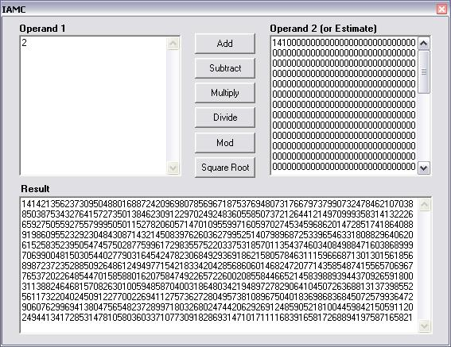



## Indefinite Accuracy Arithmetic Class

### Description

This class contains the basic arithmetic operations (+ - * / mod) and a square root function for integer operands of virtually any size. A few helper functions are also included. There is no real limit on the number of digits but your memory size and time (up to a theoretical maximum of more than four thousand million digits). However, extracting for example the root of 10,000-digit number giving a result of 5,000 accurate(!!) digits will let you drink a cup of coffee while waiting (faster when compiled -- about 27 seconds on my 1800 Athlon). The Screenshot shows the square root of 2 with about 1000 digits. Download is 8 kB.
 
### More Info
 

             |
---                |---
**Submitted On**   |2006-05-02 18:40:02
**By**             |[ULLI](https://github.com/Planet-Source-Code/PSCIndex/blob/master/ByAuthor/ulli.md)
**Level**          |Intermediate
**User Rating**    |4.3 (17 globes from 4 users)
**Compatibility**  |VB 6\.0
**Category**       |[Math/ Dates](https://github.com/Planet-Source-Code/PSCIndex/blob/master/ByCategory/math-dates__1-37.md)
**World**          |[Visual Basic](https://github.com/Planet-Source-Code/PSCIndex/blob/master/ByWorld/visual-basic.md)
**Archive File**   |[Indefinite199156522006\.zip](https://github.com/Planet-Source-Code/ulli-indefinite-accuracy-arithmetic-class__1-65197/archive/master.zip)

